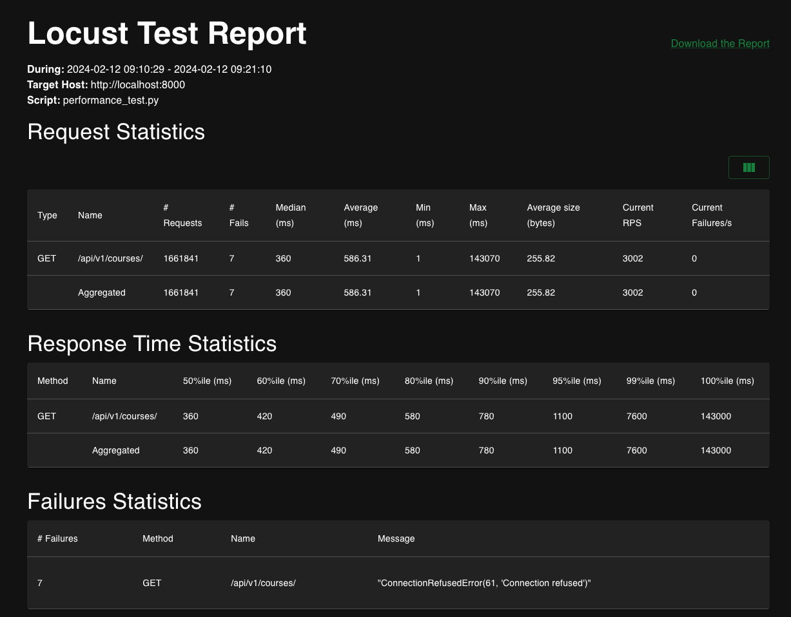
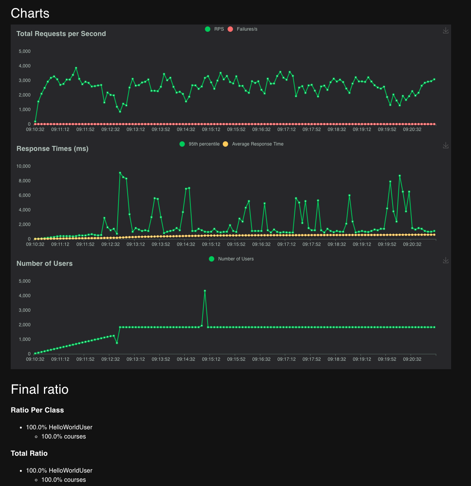

# Запуск

## Заполнение секретов

Необходимо создать `.env` файл и заполнить его следующими данными 
```
APP_ENV=prod # Продакшн

POSTGRES_DB=...
POSTGRES_HOST=...
POSTGRES_PASSWORD=...
POSTGRES_USER=...

RMQ_HOST=...
RMQ_PASS=...
RMQ_PORT=...
RMQ_USER=...
RMQ_VHOST=...

LOG_LEVEL=INFO
USE_JSON_LOGS=False
USE_IN_MEMORY_BROKER=False

REDIS_URL=...
```

## Запуск через DockerCompose
Достаточно исполнить команду

```shell
docker compose up --build -d
```

# Отчет о тестировании

Тестирование производилось с помощью `locust`

Нижу приведены скриншоты результатов тестирования




# Доработки
- Получение данных с `coin_gecko` с оплаченным доступом
  - Позволит ускорить получение данных
  - Необходимо доработать скорее всего только добавление токена (ил др авториз. данных)
- Улучшить подход к кешированию
  - Посмотреть в сторону других библиотек
  - Или написать самостоятельно
  - В зависимости от скорости обновления и требованию по свежести данных можно/нужно добавить инвалидацию